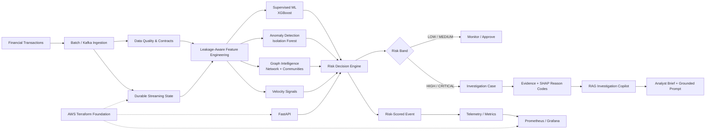

# Financial Crime & Risk Intelligence Platform

> **Enterprise-style fraud, anomaly, graph-risk, streaming, MLOps, and GenAI investigation platform built as a senior Data Scientist / AI-ML engineering portfolio project.**

[](https://github.com/mahaveerreddysamala/financial-risk-intelligence/actions)

## Executive Overview

Financial Risk Intelligence is a production-oriented reference platform for detecting suspicious financial transactions and turning model signals into an investigator-ready workflow.

Instead of stopping at a fraud-classification model, the platform connects the full lifecycle:

**transaction ingestion → data contracts → leakage-aware features → ML/anomaly scoring → graph intelligence → risk decisioning → explainability → investigation cases → grounded RAG copilot → API/streaming operations → monitoring → cloud-ready infrastructure**

The repository emphasizes **reproducibility, explicit production boundaries, model governance, distributed-state safety, observability, and security**. Synthetic data is used throughout; benchmark results are portfolio measurements rather than production fraud claims.

---

## Architecture



### Streaming path

```text
transaction.created
      │
      ▼
Kafka partition key = customer_id
      │
      ▼
Consumer Group / Horizontal Workers
      │
      ▼
Redis-backed Feature + Idempotency State
      │
      ▼
Prior-only Feature Generation
      │
      ▼
Persisted XGBoost Artifact
      │
      ├── Fraud Probability
      ├── Anomaly Signal
      ├── Network Risk
      └── Velocity Signal
      │
      ▼
Ensemble Risk Decision
      │
      ▼
transaction.risk_scored
```

---

## Key Engineering Capabilities

### Risk & Machine Learning
- Supervised fraud detection with XGBoost
- Logistic Regression baseline and model comparison
- Unsupervised anomaly detection
- Cost-sensitive risk decisioning
- Threshold selection and quality gates
- Champion/challenger model selection
- Model registry and automated promotion controls
- Persisted model artifact serving with feature-contract validation
- SHAP-based explainability and reason codes

### Graph Risk Intelligence
- Heterogeneous entity graph across customers, accounts, devices, IPs, and merchants
- Weighted network relationships and entity-reuse risk
- Community detection and community-level risk signals
- Incremental online community tracking
- Streaming graph enrichment
- Graph signals integrated directly into final risk decisioning

### Real-Time Data Engineering
- Versioned event envelopes
- Kafka producer/consumer boundaries
- Customer-keyed partitioning for ordering
- Consumer-group horizontal scaling
- Redis-backed durable feature state
- Atomic idempotency claims and leases
- Retry and dead-letter handling
- Prior-only feature generation to prevent temporal leakage
- Downstream risk-scored events and inference telemetry

### Investigation & GenAI
- Persistent investigation case lifecycle
- Idempotent case creation
- Investigator status transitions and audit events
- Evidence provenance
- TF-IDF reference retrieval
- Retrieval confidence and limitations
- Grounded analyst briefs
- RAG prompt construction with explicit anti-hallucination constraints
- Clear separation between AI assistance and analyst decision-making

### Production Engineering
- FastAPI service layer
- Dockerized API and streaming worker
- Prometheus-compatible application metrics
- Grafana dashboards
- Health/readiness/version endpoints
- Structured operational logging
- CI with automated tests and Ruff
- Terraform AWS foundation
- Environment-driven configuration
- Non-root containers
- Security and production-readiness documentation

---

## Model Governance

The model lifecycle is treated as an engineering workflow rather than a notebook exercise:

```text
Candidate Models
      │
      ▼
Quality / Performance Gates
      │
      ▼
Champion vs Challenger Evaluation
      │
      ▼
Registry + Version Metadata
      │
      ▼
Promotion Decision
      │
      ▼
Persisted Serving Artifact
      │
      ▼
Runtime Monitoring
      │
      ├── Drift
      ├── Performance
      └── Calibration
```

The project also includes monitoring and quality-gate utilities so model promotion is tied to measurable checks instead of manual assumptions.

---

## Investigation Workflow

A suspicious transaction can move through an auditable investigation lifecycle:

```text
Risk Decision
     │
     ▼
Investigation Case
     │
     ├── Transaction Evidence
     ├── Model / Risk Signals
     ├── Graph Context
     ├── Reason Codes
     └── Retrieved References
              │
              ▼
       Grounded Copilot
              │
              ▼
       Analyst Brief
              │
              ▼
     Human Investigation
```

The copilot is intentionally **grounded and non-autonomous**. It is instructed to distinguish evidence from interpretation, avoid inventing facts, and state when evidence is insufficient.

---

## API Surface

The FastAPI application exposes operational and investigation-oriented interfaces including:

| Area | Examples |
|---|---|
| Health | `/health`, `/ready`, `/version` |
| Metrics | `/metrics` |
| Model scoring | `POST /v1/model/score` |
| Investigation cases | `POST /v1/investigations/cases` |
| Case retrieval | `GET /v1/investigations/cases/{case_id}` |
| Case status | `PATCH /v1/investigations/cases/{case_id}/status` |
| Audit trail | `GET /v1/investigations/cases/{case_id}/audit` |
| Copilot prompt | `POST /v1/copilot/prompt` |
| Analyst brief | `POST /v1/copilot/cases/{case_id}/brief` |

API behavior is validated with automated tests and explicit input/error handling.

---

## Technology Stack

| Layer | Technologies |
|---|---|
| Languages | Python, SQL, Bash |
| ML | XGBoost, scikit-learn, SHAP |
| Graph | NetworkX, community detection, online graph state |
| Data | Pandas, NumPy, PyArrow |
| Streaming | Apache Kafka, consumer groups |
| State | Redis-compatible durable state |
| API | FastAPI, Uvicorn |
| Observability | Prometheus, Grafana, structured logs |
| Containers | Docker, Docker Compose |
| MLOps | MLflow, model registry, quality gates, CI/CD |
| Cloud / IaC | AWS, Terraform |
| Testing | pytest, Ruff |
| GenAI | RAG workflow, retrieval, grounded prompt generation |

---

## Validation & Benchmarks

### Verified fraud benchmark

The original reproducible 20K synthetic transaction benchmark produced:

| Model | ROC-AUC | PR-AUC | Precision | Recall | F1 |
|---|---:|---:|---:|---:|---:|
| Logistic Regression | 0.6131 | 0.0573 | 2.45% | 51.28% | 0.0468 |
| XGBoost | **0.6667** | **0.0802** | **4.44%** | 10.26% | **0.0620** |

XGBoost achieved a reported **12.87x lift** at the validation-selected `0.85` operating threshold on that synthetic workload. These are reproducible portfolio measurements and **must not be interpreted as production fraud-performance claims**.

### Scale benchmark

Phase 49 includes a measured 1M-row scale run of the synthetic transaction generation/output path:

| Rows | Partitions | Runtime | Throughput | Environment |
|---:|---:|---:|---:|---|
| **1,000,000** | **8** | **1.732874 s** | **577,075.9 rows/s** | Local Windows / Python 3.11 |

Command used:

```powershell
python scripts/benchmark_scale.py --rows 1000000 --partitions 8 --output-dir artifacts/benchmarks
```

This is a reproducible portfolio benchmark for bounded-memory synthetic transaction generation and CSV output. It is **not** a claim of 577K transactions/second for the complete fraud scoring pipeline, graph enrichment, model inference, or cloud deployment.

See [`docs/PHASE_49_SCALE_BENCHMARK.md`](docs/PHASE_49_SCALE_BENCHMARK.md) and [`docs/PHASE_49_BENCHMARK_RESULTS.md`](docs/PHASE_49_BENCHMARK_RESULTS.md).

---

## Cloud-Ready Architecture

Phase 50 introduces a Terraform AWS foundation and a documented production reference architecture.

```text
                    Internet / Enterprise Clients
                              │
                              ▼
                       ALB / API Gateway
                              │
                    ┌─────────┴─────────┐
                    ▼                   ▼
               ECS API             ECS Worker
                    │                   │
                    └─────────┬─────────┘
                              │
          ┌───────────────────┼───────────────────┐
          ▼                   ▼                   ▼
    Managed Kafka       Redis-compatible       S3
                        Feature / State       Artifacts
          │                   │
          └───────────────────┼───────────────────┘
                              ▼
                    Observability Platform
```

The Terraform foundation currently provisions the portfolio-safe building blocks needed for a cloud deployment plan, including ECR, ECS cluster, S3 artifact storage, and CloudWatch logging.

**It does not claim a live production AWS deployment.** Networking, managed Kafka/Redis, ingress, certificates, secrets, IAM policies, HA configuration, and production capacity planning remain deployment-specific extensions.

See [`docs/PHASE_50_CLOUD_ARCHITECTURE.md`](docs/PHASE_50_CLOUD_ARCHITECTURE.md) and [`infra/README.md`](infra/README.md).

---

## Local Quickstart

### 1. Clone and install

```bash
git clone https://github.com/mahaveerreddysamala/financial-risk-intelligence.git
cd financial-risk-intelligence
python -m venv .venv
source .venv/bin/activate       # Windows: .venv\Scripts\activate
pip install -r requirements.txt
```

### 2. Run quality checks

```bash
ruff check src tests scripts
pytest
```

### 3. Run the API

```bash
uvicorn financial_risk.api.app:app --host 0.0.0.0 --port 8000
```

### 4. Run the local production-style stack

```bash
docker compose up --build
```

The Docker Compose environment provides a reproducible local boundary for the API, Kafka, Redis, streaming worker, Prometheus, and Grafana components.

---

## Repository Guide

```text
financial-risk-intelligence/
├── src/financial_risk/       # Core risk, ML, graph, streaming, API, investigation code
├── tests/                    # Automated unit/integration coverage
├── scripts/                  # Benchmarking and operational utilities
├── docs/                     # Architecture, runbooks, phase documentation
├── infra/terraform/aws/      # Cloud infrastructure foundation
├── .github/workflows/        # CI and infrastructure validation
├── docker-compose.yml        # Local production-style stack
├── requirements.txt          # Runtime/test dependencies
└── SECURITY.md               # Security guidance and reporting
```

---

## Engineering Principles

1. **No data leakage** — features are generated from information available before the scored transaction.
2. **Evidence over claims** — benchmarks and deployment statements are documented only when measured or validated.
3. **Human-in-the-loop investigations** — GenAI assists analysts rather than making autonomous case conclusions.
4. **Idempotent distributed processing** — duplicate events must be safely suppressed across workers.
5. **Observable services** — risk decisions expose operational telemetry and health signals.
6. **Explicit production boundaries** — local Docker validation is not presented as managed production infrastructure.
7. **Secure by default** — credentials are environment/configuration concerns, containers avoid root execution, and production security controls are documented before deployment.

---

## Project Status

| Area | Status |
|---|---|
| ML fraud/anomaly risk engine | ✅ Complete |
| Model registry / promotion / quality gates | ✅ Complete |
| Drift / performance / calibration monitoring | ✅ Complete |
| Graph risk + community intelligence | ✅ Complete |
| Kafka streaming + horizontal scaling | ✅ Complete |
| Durable Redis state + atomic idempotency | ✅ Complete |
| Investigation workflow + auditability | ✅ Complete |
| GenAI/RAG investigation copilot | ✅ Complete |
| Large-scale benchmark runner | ✅ Complete |
| 1M-row benchmark measurement | ✅ Measured — 1.73 s / 577K rows/s on local run |
| Cloud architecture + Terraform foundation | ✅ Complete |
| Live production cloud deployment | 🟡 Not claimed |
| Final portfolio documentation | ✅ Complete |

---

## Documentation

- [`docs/PHASE_49_SCALE_BENCHMARK.md`](docs/PHASE_49_SCALE_BENCHMARK.md) — scale benchmark methodology
- [`docs/PHASE_49_BENCHMARK_RESULTS.md`](docs/PHASE_49_BENCHMARK_RESULTS.md) — measured-result matrix
- [`docs/PHASE_50_CLOUD_ARCHITECTURE.md`](docs/PHASE_50_CLOUD_ARCHITECTURE.md) — cloud reference architecture
- [`docs/PHASE_50_STATUS.md`](docs/PHASE_50_STATUS.md) — Phase 50 delivery status
- [`docs/production-readiness.md`](docs/production-readiness.md) — operational readiness and deployment boundaries
- [`infra/README.md`](infra/README.md) — Terraform usage and safety guidance
- [`SECURITY.md`](SECURITY.md) — security expectations and vulnerability reporting

---

## Resume-Ready Project Summary

**Financial Crime & Risk Intelligence Platform** — Built an enterprise-style financial risk platform combining XGBoost fraud detection, anomaly detection, graph/community intelligence, Kafka streaming, Redis-backed distributed state, model governance, SHAP explainability, investigation case management, and a grounded RAG/GenAI copilot; implemented automated quality gates, streaming observability, Docker-based deployment, and a Terraform AWS foundation with reproducible CI validation.

### Strong interview talking points

- **Data Science:** leakage-aware feature engineering, imbalanced fraud classification, threshold/cost-sensitive decisioning, calibration, explainability, and model monitoring.
- **Data Engineering:** Kafka partitioning, consumer groups, retries/DLQ, Redis atomicity, durable state, idempotency, and streaming feature generation.
- **AI/GenAI:** grounded retrieval, provenance, analyst briefs, prompt constraints, and human-in-the-loop investigation workflows.
- **MLOps:** champion/challenger evaluation, registry metadata, automated promotion gates, persisted artifacts, and runtime monitoring.
- **Cloud/Platform:** Docker, FastAPI, Prometheus/Grafana, Terraform, AWS architecture, health checks, security boundaries, and CI/CD.

---

## License

This repository is intended as a professional portfolio and reference implementation. See repository licensing and security documentation for applicable usage guidance.
