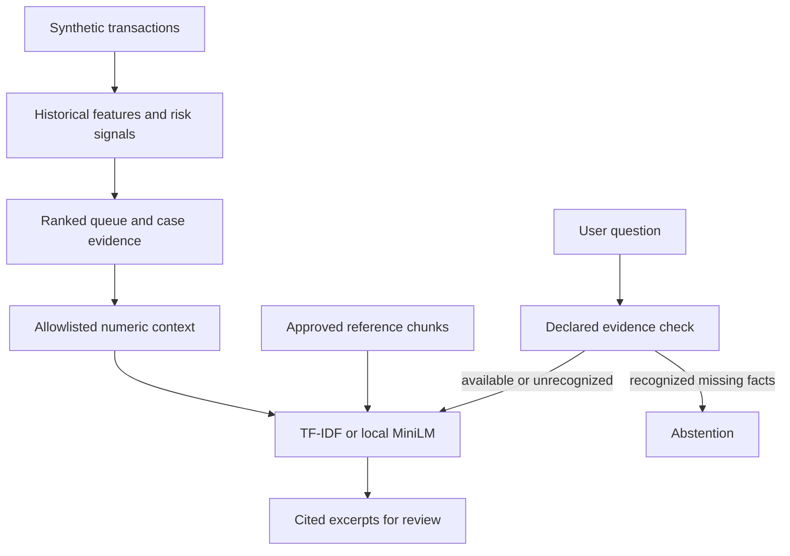

# Financial Risk Intelligence: project case study

## Problem and scope

An investigation workflow needs to rank transactions under limited review capacity and
explain the available evidence without presenting risk scores as proof of wrongdoing.
This synthetic-data portfolio combines a fraud-analysis dashboard with a read-only reference
copilot. The public UI uses TF-IDF excerpts; pinned MiniLM is an optional local backend.
Hosted synthesis is implemented for developer opt-in, but paid calls remain disabled in the UI.

## Architecture and engineering decisions

The model workflow uses chronological splits, with precision/recall and investigation-capacity
metrics alongside ROC-AUC. The retrieval layer owns a document snapshot and preserves stable
source identifiers. Selected cases contribute five validated numeric signal types; identifiers
and free text are excluded from that context. This is minimization, not general PII redaction.

TF-IDF provides a small, fast baseline without model downloads. MiniLM is pinned to a model
revision, loaded on CPU with remote code disabled, and cached-only by default. Separate
thresholds avoid treating lexical and semantic scores as interchangeable confidence estimates.
Citation-ID validation catches missing or unknown IDs but does not establish claim support.

## Measured evidence

| Experiment | Result | Interpretation |
|---|---|---|
| 50-question challenge: 40 answerable, 10 unsupported | TF-IDF / MiniLM Recall@3: 0.90 / 1.00; MRR@3: 0.8333 / 0.9375 | Ranking before thresholding |
| Same challenge, acceptance | Unsupported accepts: 5/10 / 1/10; answerable accepts: 33/40 / 33/40 | Better ranking alone did not remove abstention errors |
| Same challenge, median retrieval latency | 0.497 ms / 10.849 ms | CPU run, not a service latency guarantee |
| Separate 30-question threshold experiment | 0.35 and 0.36 both accepted 1/10 unsupported and rejected 4/20 answerable | Rejected the proposed threshold change |
| 36-question evidence-scope experiment | TF-IDF unsupported accepts fell 7/18 to 2/18; answerable rejects stayed 4/18 | Narrow rule coverage improved this fixture |
| Same evidence-scope experiment, MiniLM | 0/18 unsupported accepts and 3/18 answerable rejects, unchanged | No measured incremental semantic benefit |

All questions are AI-authored against a six-chunk synthetic corpus. Separate fixtures are
not independent human validation. Timings and results are environment-specific; they are not
production impact, clinical/legal conclusions, or generated-answer factuality measurements.

## Failure analysis and judgment

A request for exact transaction loss retrieved general velocity guidance. Topical similarity
was insufficient because the required record did not exist. Raising the threshold fixed that
development example but failed a separate validation gate, so the runtime threshold stayed
unchanged. The next change used an explicit evidence declaration for missing loss records,
identities and forecasts. Its narrow English rules still miss paraphrases and are not a
security boundary. The retained failures make the limits reviewable.

## Verification and deployment finding

PR #9 passed Python 3.11/3.12 CI, model-quality gates, dashboard smoke and Docker checks,
then merged as `c24c63db8ae5c92b300dc798a99e1c0e7d0e0be4`.

Live verification on 2026-09-06 loaded the dashboard, but submitting a missing-loss question
failed with `TypeError: answer_question() got an unexpected keyword argument 'case'`.
It persisted after one browser reload. Deployment logs show code updates without a fresh
runtime start, consistent with a stale imported function. After explicit user authorization,
the app was rebooted on 2026-09-06 (runtime startup recorded at 20:35 UTC). Live retesting
then passed: general shared-device retrieval returned `[S1]`; synthetic selected case
`TXN000000590` returned `[E1]` through `[E5]` with reference citations; the exact-loss question
returned the missing-evidence explanation in both reference-only and selected-case modes.
No code changes or paid LLM calls were needed for recovery. These checks verify the exercised
flows, not general model quality or an uptime guarantee. This incident illustrates why passing
CI and a loaded homepage do not prove a working deployed flow.

## Interview walkthrough

Explain the operational review-capacity problem, show the cited-source comparison, then
walk through the failed threshold experiment and why it was rejected. Distinguish retrieval
acceptance from supported answers, and automated tests from live deployment checks.
Use `retrieval-comparison.html` and the recorded `retrieval-demo.cast` for reproducible demos.

Resume bullet: Built a synthetic financial-investigation copilot with lexical and pinned CPU
semantic retrieval, cited evidence, explicit data minimization, reproducible evaluation and
CI; reduced TF-IDF unsupported acceptance from 7/18 to 2/18 on an AI-authored scope-check
fixture with no additional answerable rejections, documenting remaining failures.

Evidence: [challenge](retrieval-challenge.md), [threshold experiment](abstention-analysis.md),
[evidence scope](evidence-availability.md), [RAG limits](investigation-rag.md).
